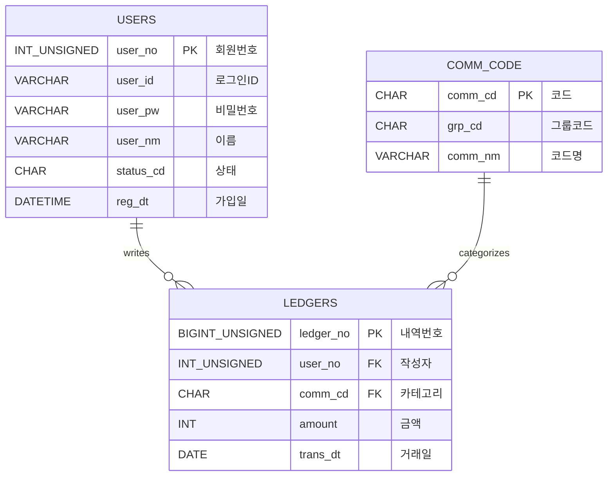

# 📒 Household Ledger (가계부 프로젝트) - Team 2

팀 2의 가계부 관리 프로젝트입니다. Spring Boot와 MyBatis, MariaDB를 기반으로 구축되었습니다.

## 👨‍👩‍👦‍👦 팀원 및 역할 (Team Members)

| 이름 | 역할 | 담당 파트 |
|---|---|---|
| **정진호** | **Team Leader** | **공통 설계 / DB / 로그인 / 통합** |
| **윤성원** | Developer | **회원 관리** (가입, 수정, 탈퇴) |
| **정병진** | Developer | **가계부 CRUD** (내역 등록/조회) |
| **최현지** | Developer | **통계 & 조회** (차트, 필터링) |
| **김태형** | Documentation | **문서화 & 알림** (사용 가이드) |

---

## 🛠 기술 스택 (Tech Stack)

- **Language**: Java 17
- **Framework**: Spring Boot 3.5.9
- **Persistence**: MyBatis 3.0.5
- **Database**: MariaDB
- **Build Tool**: Gradle
- **Template Engine**: Thymeleaf (Optional) or Vue.js/React (Frontend)

---

## 🏛 기획 및 설계 (Design & Architecture)

### 1. 유스케이스 다이어그램 (Use Case Diagram)
사용자와 시스템 간의 상호작용을 나타냅니다.

```mermaid
usecaseDiagram
    actor "사용자 (User)" as U

    package "회원 시스템" {
        usecase "회원가입" as UC1
        usecase "로그인" as UC2
        usecase "내 정보 수정" as UC3
        usecase "회원 탈퇴" as UC4
    }

    package "가계부 시스템" {
        usecase "수입/지출 등록" as UC5
        usecase "내역 조회" as UC6
        usecase "내역 수정/삭제" as UC7
    }

    U --> UC1
    U --> UC2
    U --> UC3
    U --> UC4
    U --> UC5
    U --> UC6
    U --> UC7
```

### 2. 데이터베이스 설계 (ERD)
회원(`users`)과 공통 코드(`comm_code`), 가계부 내역(`ledgers`) 간의 관계입니다.

**네이밍 규칙 (Naming Convention)**
- **ID/PK**: `_no` (Auto Increment), `_cd` (코드 PK), `_id` (사용자 입력 ID)
- **Code**: `_cd` (참조 키, 상태 코드 등)
- **Name**: `_nm` (사용자명, 코드명 등)
- **Date**: `_dt` (일시)



---

## 🚀 사용 가이드 (Developer Guide)

### 1. DB 설정
로컬 MariaDB에 `household_ledger` 데이터베이스를 생성하고 아래 사용자 계정을 확인하세요.
- URL: `jdbc:mariadb://localhost:3306/household_ledger`
- User: `root`
- Password: `1234` (기본값, `application.properties`에서 변경 가능)

### 2. 공통 코드 유틸리티 사용법
`CommonCodeService`를 주입받아 사용합니다.

```java
@Autowired
private CommonCodeService codeService;

// 1. 특정 그룹의 코드 목록 가져오기 (예: 화면의 셀렉트 박스 구성)
List<CommCode> incomeCodes = codeService.getCodesByGroup("INC"); 
// Result: [{commCd:"INC01", commNm:"월급"}, ...]

// 2. 단일 코드명 변환 (예: 리스트 조회 시 코드->이름)
String codeName = codeService.getCodeName("EXP01");
// Result: "식비"
```

### 3. 로그인 테스트
- **Server Start**: `./gradlew bootRun`
- **Login API**: `POST /login`
  ```json
  {
    "userId": "test",
    "userPw": "1234"
  }
  ```
