# 💰 한푼한푼 (Household Ledger) - Team 2

**"티끌 모아 태산!"** 💸
팀 2의 스마트한 가계부 프로젝트 **한푼한푼**입니다.
Spring Boot 3, MyBatis, MariaDB를 기반으로 구축되었으며, **Glassmorphism** 디자인을 적용하여 사용자 경험을 강화했습니다.

<br>

<details>
<summary><b>📖 프로젝트 소개 (Project Info)</b></summary>
<br>

### 📑 목차 (Table of Contents)
- [👨‍👩‍👦‍👦 팀원 및 역할](#team-members)
- [🖥 화면 구성 및 담당자](#screens)
- [🔨 기술 스택](#tech-stack)
- [📝 요구사항 명세](#requirements)
- [🏛 기획 및 설계](#design)

---

<a id="team-members"></a>
## 👨‍👩‍👦‍👦 팀원 및 역할 (Team Members)

| 이름 | 역할 | 담당 파트 |
|---|---|---|
| **정진호** | **Team Leader** | **공통 설계 / DB / 로그인 / 통합** |
| **윤성원** | Developer | **회원 관리** (가입, 수정, 탈퇴) |
| **정병진** | Developer | **알림** (예산 초과 알림) |
| **최현지** | Developer | **통계 & 조회** (차트, 필터링) |
| **김태형** | Developer | **가계부 CRUD** (내역 등록/조회) |

---

<a id="screens"></a>
## 🖥 화면 구성 및 담당자 (Screen Layout & Responsibilities)

### 1. 메인 화면 (Main Page)
전체 레이아웃(`layout.html`)과 메인 대시보드는 **Glassmorphism** 디자인이 적용되어 있습니다.

| 영역 | 설명 | 담당자 |
|---|---|---|
| **Header** | 로고 및 GNB (홈, 통계, 로그인) | 공통 (정진호) |
| **Hero Section** | 환영 문구 및 주요 액션 버튼 | 공통 (정진호) |
| **Dashboard** | 월별 지출, 오늘의 소비, 예산 현황 요약 카드 | **최현지** (데이터 연동) |
| **Modals** | 로그인, 회원가입, 가계부 작성 팝업 | 하단 상세 참조 |

---

<a id="tech-stack"></a>
##  기술 스택 (Tech Stack)

- **Language**: Java 17
- **Framework**: Spring Boot 3.5.9
- **Frontend**: Vue.js 3, Thymeleaf
- **Persistence**: MyBatis 3.0.5
- **Database**: MariaDB
- **Build Tool**: Gradle

---

<a id="requirements"></a>
## 📝 요구사항 명세 (Requirements Specification)

### 1. 회원 관리 (Member Management)
*담당: 윤성원*
- **회원가입**: 아이디(중복확인), 비밀번호, 이름, 이메일 입력.
- **로그인**: 세션 기반 인증.
- **회원 정보**: 본인 정보 조회 및 수정.
- **회원 탈퇴**: `status_cd`를 'N'으로 변경 (Soft Delete).

### 2. 가계부 관리 (Ledger CRUD)
*담당: 김태형*
- **카테고리**: 공통 코드(`comm_cd`)를 사용하여 수입/지출 분류.
- **등록**: 날짜, 금액, 카테고리, 메모 입력.
- **조회**: 전체 내역 최신순 조회.
- **수정/삭제**: 본인이 작성한 내역만 처리 가능.

### 3. 통계 및 조회 (Statistics)
*담당: 최현지*
- **월별 통계**: 이번 달 총 수입/지출액 표시.
- **카테고리별 통계**: 식비, 교통비 등 카테고리별 지출 비중 확인.
- **필터링**: 기간별, 카테고리별 내역 조회.

### 4. 알림 (Notification)
*담당: 정병진*
- **알림**: 예산 초과 시 알림 로직 설계 및 구현.

### 5. 예산 관리 및 월별 요약 (Budget & Summary)
*담당: 최현지*
- **예산 설정**: 월별 총 예산 및 카테고리별 예산 설정.
- **월별 요약**: 가계부 등록/삭제 시 트리거를 통해 월별 수입/지출 합계 자동 갱신.

---

<a id="design"></a>
## 🏛 기획 및 설계 (Design & Architecture)

### 1. 유스케이스 다이어그램 (Use Case Diagram)

```mermaid
graph LR
    %% 1. 사용자 액터 (좌측 배치)
    User((👤 사용자))
    style User fill:#ffffff,stroke:#333,stroke-width:2px

    %% 2. 전체 시스템
    subgraph System ["가계부 시스템 (Household Ledger)"]
    direction TB
        
        %% (1) 회원 관리 패키지
        subgraph Member [회원 관리 - 윤성원]
            direction TB
            Join(회원가입)
            Login(로그인)
            Update(내 정보 수정)
            Withdraw(회원 탈퇴)
        end

        %% (2) 가계부 패키지
        subgraph Ledger [가계부 - 김태형]
            direction TB
            List(내역 조회)
            Write(가계부/메모 등록)
            Edit(수정/삭제)
            CheckCat[카테고리 확인]
        end

        %% (3) 통계 및 알림 패키지
        subgraph Stats [통계 - 최현지]
            direction TB
            MonthStats(월별 통계)
            CatStats(카테고리별 통계)
            SetBudget(예산 설정)
        end

        subgraph Notice [알림 - 정병진]
            direction TB
            Alert(예산 초과 알림)
        end
    end

    %% 3. 연결선 (최대한 꼬이지 않게 순서 배치)
    User --> Join
    User --> Login
    User --> Update
    User --> List
    User --> Write
    User --> Edit
    User --> MonthStats
    User --> CatStats
    User --> SetBudget

    %% 4. 관계 정의 (Include & Extend)
    %% 가계부 등록 -> (포함) -> 카테고리 확인
    Write --> |include| CheckCat
    %% 알림 -> (확장: 조건부 실행) -> 가계부 등록
    Alert -.-> |extend| Write

    %% 5. 스타일링 (색상 구분)
    classDef memClass fill:#e3f2fd,stroke:#1e88e5,stroke-width:1px;
    class Join,Login,Update,Withdraw memClass;

    classDef ledClass fill:#e8f5e9,stroke:#43a047,stroke-width:1px;
    class List,Write,Edit,CheckCat ledClass;

    classDef statClass fill:#fff3e0,stroke:#fb8c00,stroke-width:1px;
    class MonthStats,CatStats statClass;

    classDef notiClass fill:#fce4ec,stroke:#d81b60,stroke-width:1px;
    class Alert notiClass;
```

**`graph LR`** 을 사용하여 팀원들이 구현할 기능의 포함(`<<include>>`) 및 확장(`<<extend>>`) 관계를 표현했습니다.



### 2. 데이터베이스 설계 (ERD)
팀원별 기능 구현에 필요한 테이블 구조입니다. **(1 : N 관계 명시)**

**Q. 왜 공통 코드 PK(`comm_cd`)는 `CHAR(5)`인가요?**
> 일반적으로 PK는 Auto Increment(`INT`)를 많이 쓰지만, 공통 코드는 성격이 다릅니다.
> 1.  **고정된 길이**: 코드는 `INC01`, `EXP01` 처럼 규칙과 길이가 정해져 있으므로 `CHAR`가 저장 효율 및 검색 속도 면에서 유리할 수 있습니다.
> 2.  **직관성(가독성)**: `101`번 코드보다 `INC01`(Income 01)이 코드 자체만으로 의미를 파악하기 쉽습니다. (디버깅 용이)
> 3.  **조인 성능**: 고정 길이 문자열은 인덱싱 및 조인 시 성능 예측이 용이합니다.

```mermaid
erDiagram
    users {
        INT_UNSIGNED user_no PK "회원번호"
        VARCHAR user_id "로그인ID"
        VARCHAR user_pw "비밀번호"
        VARCHAR user_nm "이름"
        CHAR status_cd "상태 (Y/N)"
        DATETIME reg_dt "가입일"
    }
    
    comm_code {
        CHAR comm_cd PK "코드 (CHAR 5)"
        CHAR grp_cd "그룹코드"
        VARCHAR comm_nm "코드명"
    }
    
    ledgers {
        INT_UNSIGNED ledger_no PK "내역번호"
        INT_UNSIGNED user_no FK "작성자"
        CHAR comm_cd FK "카테고리"
        INT amount "금액"
        DATE trans_dt "거래일"
        VARCHAR memo "메모/비고"
    }

    budgets {
        INT_UNSIGNED budget_no PK "예산번호"
        INT_UNSIGNED user_no FK "사용자"
        INT target_year "년"
        INT target_month "월"
        INT budget_amt "총예산"
    }

    budget_cates {
        INT_UNSIGNED budget_cate_no PK "상세예산번호"
        INT_UNSIGNED budget_no FK "예산번호"
        CHAR comm_cd FK "카테고리"
        INT budget_amt "목표금액"
    }

    monthly_summary {
        INT_UNSIGNED summary_no PK "요약번호"
        INT_UNSIGNED user_no FK "사용자"
        INT target_year "년"
        INT target_month "월"
        INT total_inc_amt "총수입"
        INT total_exp_amt "총지출"
    }

    %% 관계 설정 (1 : N)
    users ||--o{ ledgers : "1 : N (작성)"
    comm_code ||--o{ ledgers : "1 : N (분류)"
    users ||--o{ budgets : "1 : N"
    budgets ||--o{ budget_cates : "1 : N"
    comm_code ||--o{ budget_cates : "1 : N"
    users ||--o{ monthly_summary : "1 : N"
```



</details>

<br>

<details>
<summary><b>🛠 개발 가이드 (Dev Guide)</b></summary>
<br>

### 📑 목차 (Table of Contents)
- [👨‍💻 팀원별 작업 가이드](#work-guide)
- [🎨 UI 연동 가이드](#ui-guide)
- [🚀 개발 가이드](#dev-guide)
- [🐙 GitHub 협업 가이드](#git-workflow)
- [📜 설치 및 실행](#setup)

---

<a id="work-guide"></a>
## 👨‍💻 팀원별 작업 가이드 (Work Guide)
팀장(정진호)이 **기본 스켈레톤(Skeleton)** 코드를 모두 생성해두었습니다.
각 담당자는 본인의 패키지 내 파일만 수정하면 됩니다. **다른 사람의 코드는 건드리지 마세요!**

### 1. **윤성원** (회원 관리)
- **작업 경로**: `src/main/java/com/team2/householdledger/member`
- **수정해야 할 파일**:
    - `controller/MemberController.java`: 회원가입(`join`), 수정, 탈퇴 로직 채우기
    - `service/UserService.java`: 비즈니스 로직 (비밀번호 암호화 등)
    - `mapper/UserMapper.xml`: 추가 쿼리 필요 시 작성
- **참고**: `LoginController.java`는 이미 완성되어 있으니 참고용으로만 보세요.

### 2. **김태형** (가계부 CRUD)
- **작업 경로**: `src/main/java/com/team2/householdledger/ledger`
- **수정해야 할 파일**:
    - `dto/LedgerDTO.java`: 필요 시 필드 추가
    - `controller/LedgerController.java`: 수정(`PUT`), 삭제(`DELETE`) 메서드 완성
    - `service/LedgerService.java`: 본인 확인 로직 등 추가
    - `mapper/LedgerMapper.xml`: **Axis Style** (좌측 정렬) 양식 준수!
- **참고**: 주석에 적힌 `TODO` 항목들을 하나씩 해결하면 됩니다.

### 3. **최현지** (통계)
- **작업 경로**: `src/main/java/com/team2/householdledger/stats`
- **수정해야 할 파일**:
    - `dto/StatsDTO.java`: 통계 결과 담을 필드 확장
    - `mapper/StatsMapper.xml`: `GROUP BY` 쿼리 작성 (월별, 카테고리별)
    - `controller/StatsController.java`: 월별 통계 API 추가 구현
- **참고**: 복잡한 쿼리는 팀장(정진호)에게 질문하세요. DB 함수 `fn_get_comm_nm` 적극 활용!

### 4. **정병진** (알림)
- **작업 경로**: `src/main/java/com/team2/householdledger/notice`
- **수정해야 할 파일**:
    - `dto/NoticeDTO.java`: 알림 필드 확장
    - `controller/NoticeController.java`: 알림 API 구현 (메모리상 처리 또는 단순 로그)
    - **삭제됨**: `mapper/NoticeMapper.xml` (테이블 미사용으로 삭제)
- **참고**: `NoticeService.sendNotice()` 메서드는 다른 팀원이 호출해서 쓸 수 있게 설계하세요. (DB 저장 없음)

---

---

<a id="ui-guide"></a>
## 🎨 UI 연동 가이드 (Frontend Integration Guide)
**팀장(정진호)**이 만들어둔 메인 화면(`main.html`)의 모달창과 본인의 기능을 연결하는 방법입니다.
화면 코드는 `src/main/resources/templates/main.html`에 모두 모여 있습니다.

### 📌 화면별 담당자 지정

| 화면 요소 | 파일 위치 | 담당자 | 비고 |
|---|---|---|---|
| **로그인 모달** | `main.html` (Modal 1) | **윤성원** | `activeModal === 'login'` |
| **회원가입 모달** | `main.html` (Modal 2) | **윤성원** | `activeModal === 'join'` |
| **내역 등록 모달** | `main.html` (Modal 3) | **김태형** | `activeModal === 'register'`, `memo` 필드 포함 |
| **통계 위젯** | `main.html` (Dashboard) | **최현지** | `Mock Data` 부분을 API로 대체 |

### 1. **윤성원** (로그인/회원가입)
- **위치**: `main.html` 내부 `<!-- 1. LOGIN MODAL -->` 및 `<!-- 2. JOIN MODAL -->` 주석 찾기.
- **연동 방법 (택 1)**:
    1.  **Form 전송 방식 (기본)**: `<form>` 태그에 `action="/login"` `method="post"` 속성 추가. (Vue 이벤트 `@submit.prevent`는 제거)
    2.  **AJAX 방식 (권장)**: 하단 `<script>` 내부 `submitLogin` 함수에 `fetch` 또는 `axios` 로직 작성.

### 2. **김태형** (가계부 등록)
- **위치**: `main.html` 내부 `<!-- 3. LEDGER WRITE MODAL -->` 주석 찾기.
- **연동 방법**:
    -   `<form>` 내부의 `input` 태그들에 `name="amount"`, `name="transDt"` 등 DTO 필드명과 일치하는 `name` 속성 추가.
    -   `<form action="/ledger/add" method="post">` 처럼 컨트롤러 경로 지정.

### 3. **최현지** (통계)
- **위치**: `main.html` 하단 `<script>` 영역의 `Mock Data` 부분.
- **연동 방법**:
    -   현재 `setTimeout`으로 가짜 데이터가 들어가 있습니다.
    -   페이지 로딩 시(`onMounted`) `fetch('/stats/summary')` 등을 호출하여 실제 DB 데이터를 가져오도록 수정하세요.

### ⚠️ 주의사항
- **디자인 유지**: `class="glass-card"`, `class="btn-primary"` 등 디자인 클래스는 **지우지 마세요.**
- **Vue.js**: 화면의 열고 닫힘은 Vue.js가 담당합니다. 로직이 꼬이지 않게 **스크립트 부분 수정 시 주의**하세요.

---

<a id="dev-guide"></a>
## 🚀 개발 가이드 (Development Guide)

### 1. DB 연결 및 초기화
로컬 MariaDB에 `household_ledger` 데이터베이스를 생성하고 아래 사용자 계정을 확인하세요.
- URL: `jdbc:mariadb://localhost:3306/household_ledger`
- User: `root` / Password: `1234`
- **필수**: 하단 스크립트의 **DB 함수(`fn_get_comm_nm`)** 생성 구문을 반드시 실행해야 합니다.

### 2. 공통 코드 설명 (Common Code Reference)
본 프로젝트에서 사용하는 주요 그룹 코드(`grp_cd`)입니다.

| 그룹 코드 | 의미 | 예시 (`comm_cd`) |
|---|---|---|
| **INC** | 수입 (Income) | `INC01`(월급), `INC02`(용돈) |
| **EXP** | 지출 (Expense) | `EXP01`(식비), `EXP02`(교통비) |

### 3. DB 함수 사용법 (`fn_get_comm_nm`) 상세
코드명을 가져올 때는 무조건 이 함수를 사용합니다.

**기본 문법:**
```sql
SELECT fn_get_comm_nm('코드값'); -- 결과: '코드명'
```

**실전 활용 (MyBatis):**
```xml
<select id="getLedgerList" resultType="LedgerDTO">
    SELECT 
        ledger_no, 
        amount, 
        -- 조인 없이 함수 호출만으로 코드명을 가져옵니다.
        fn_get_comm_nm(comm_cd) AS category_nm 
    FROM ledgers
    WHERE user_no = #{userNo}
</select>
```

### 4. SQL 작성 규칙 (**Axis Style**)
가독성을 위해 SQL 작성 시 **Axis Style(축 정렬)**을 준수해주세요.
- **키워드(SELECT, FROM, WHERE 등)는 우측 정렬**, 내용은 좌측 정렬하여 세로 축을 맞춥니다.
- 쉼표(`,`)는 **앞쪽**에 배치합니다.

**✅ 올바른 예시:**
```sql
SELECT user_no
     , user_id
     , user_nm
  FROM users
 WHERE status_cd = 'Y'
   AND user_id   = #{userId}
```

### 5. 통계/예산 쿼리 가이드 (Stats & Budget Reference)
**최현지(통계)** 님은 아래 방향성을 참고하여 스스로 쿼리를 작성해보세요.

**1. 이번 달 현황 조회 (Hint)**
- **목표**: 특정 연/월의 총 수입과 총 지출을 가져오기.
- **테이블**: `monthly_summary`
- **방법**: `user_no`, `target_year`, `target_month`가 일치하는 행을 조회하면 `total_inc_amt`(수입), `total_exp_amt`(지출) 컬럼에 이미 합산된 값이 들어있습니다. (별도 `SUM` 불필요)

**2. 예산 대비 지출 확인 (Hint)**
- **목표**: 설정한 예산에서 현재까지의 지출을 빼서 '남은 돈' 계산하기.
- **테이블**: `budgets` (기준), `monthly_summary` (참조)
- **방법**:
    1.  `budgets` 테이블을 메인으로 잡고 `monthly_summary`를 **LEFT JOIN** 하세요. (예산은 있는데 지출이 '0'원인 경우도 있으니까요!)
    2.  `target_year`와 `target_month`가 서로 일치해야 합니다.
    3.  **잔액 계산**: `budget_amt` - `total_exp_amt`
    4.  ⚠️ **주의**: 지출 내역이 아예 없으면 `monthly_summary` 쪽이 `NULL`이 될 수 있습니다. `IFNULL` 또는 `COALESCE` 함수로 0원 처리를 꼭 해주세요.

---

<a id="git-workflow"></a>
## 🐙 GitHub 협업 가이드 (Git Workflow)
**⚠️ 직접 `Push` 권한이 없으므로 'Fork & Pull Request' 방식을 사용합니다.**
원본 저장소(`main`)를 보호하기 위함이며, 아래 절차를 반드시 따라주세요.

### 1. Fork 및 Clone (최초 1회)
1.  GitHub 상단 **[Fork]** 버튼 클릭 ➔ 내 계정으로 저장소 복제.
2.  **내 계정의 저장소(Forked)**를 Clone 합니다.
    ```bash
    # 주의: fdrn9999/team2 주소가 아닙니다! 본인 아이디 주소여야 합니다.
    git clone https://github.com/{본인깃허브아이디}/team2.git
    cd team2
    ```

### 2. 브랜치 생성 및 작업
```bash
# 1. 습관적으로 브랜치 생성 (main에서 작업 금지!)
# 형식: feature/이름-기능 (예: feature/yoon-join)
git checkout -b feature/yoon-join

# 2. 코드 작성 후 커밋
git add .
git commit -m "feat: 회원가입 로직 구현"

# 3. 내 원격 저장소(origin)에 푸시
git push origin feature/yoon-join
```

### 3. PR (Pull Request) 작성 및 동기화
1.  GitHub 원본 저장소(`fdrn9999/team2`) 접속.
2.  **"Compare & pull request"** 버튼 클릭.
3.  **방향 확인 (Merge 방향)**:
    - Base: `fdrn9999/team2` (`main`) ⬅️ Head: `{본인아이디}/team2` (`feature/...`)
4.  **팀장(정진호)**에게 승인(`Approve`)을 받아야 Merge 됩니다.

---

<a id="setup"></a>
## 📜 설치 및 실행 (Setup)

### 1. DB 초기화 (SQL 실행)
MariaDB 클라이언트에서 아래 스크립트를 실행하세요. (**함수 생성 포함**)

```sql
DROP DATABASE IF EXISTS household_ledger;
CREATE DATABASE household_ledger;
USE household_ledger;

-- ============================================
-- 1. 회원 테이블
-- ============================================
CREATE TABLE users (
    user_no     INT UNSIGNED AUTO_INCREMENT PRIMARY KEY,
    user_id     VARCHAR(20) NOT NULL UNIQUE,
    user_pw     VARCHAR(100) NOT NULL,
    user_nm     VARCHAR(30) NOT NULL,
    status_cd   CHAR(1) DEFAULT 'Y' CHECK (status_cd IN ('Y', 'N')),
    reg_dt      DATETIME DEFAULT CURRENT_TIMESTAMP
);

-- ============================================
-- 2. 공통 코드 테이블
-- ============================================
CREATE TABLE comm_code (
    comm_cd     CHAR(5) PRIMARY KEY,
    grp_cd      CHAR(3) NOT NULL,
    comm_nm     VARCHAR(30) NOT NULL,
    sort_no     TINYINT DEFAULT 1
);

-- ============================================
-- 3. 가계부 테이블
-- ============================================
CREATE TABLE ledgers (
    ledger_no   INT UNSIGNED AUTO_INCREMENT PRIMARY KEY,
    user_no     INT UNSIGNED NOT NULL,
    comm_cd     CHAR(5) NOT NULL,
    amount      INT NOT NULL,
    trans_dt    DATE NOT NULL,
    memo        VARCHAR(255),
    status_cd   CHAR(1) DEFAULT 'Y' CHECK (status_cd IN ('Y', 'N')),

    FOREIGN KEY (user_no) REFERENCES users (user_no),
    FOREIGN KEY (comm_cd) REFERENCES comm_code (comm_cd)
);

-- ============================================
-- 4. 월별 예산 테이블
-- ============================================
CREATE TABLE budgets (
    budget_no     INT UNSIGNED AUTO_INCREMENT PRIMARY KEY,
    user_no       INT UNSIGNED NOT NULL,

    target_year   INT NOT NULL,
    target_month  INT NOT NULL,

    budget_amt    INT NOT NULL,
    reg_dt        DATETIME DEFAULT CURRENT_TIMESTAMP,

    CONSTRAINT uk_budget_user_month UNIQUE (user_no, target_year, target_month),
    CONSTRAINT fk_budget_user
        FOREIGN KEY (user_no)
        REFERENCES users (user_no)
        ON DELETE CASCADE
);

-- ============================================
-- 5. 카테고리별 예산 테이블 (확장용)
-- ============================================
CREATE TABLE budget_cates (
    budget_cate_no INT UNSIGNED AUTO_INCREMENT PRIMARY KEY,
    budget_no      INT UNSIGNED NOT NULL,
    comm_cd        CHAR(5) NOT NULL,
    budget_amt     INT NOT NULL,
    reg_dt         DATETIME DEFAULT CURRENT_TIMESTAMP,

    CONSTRAINT uk_budget_cate UNIQUE (budget_no, comm_cd),
    CONSTRAINT fk_budget_cate_budget
        FOREIGN KEY (budget_no)
        REFERENCES budgets (budget_no)
        ON DELETE CASCADE,
    CONSTRAINT fk_budget_cate_comm
        FOREIGN KEY (comm_cd)
        REFERENCES comm_code (comm_cd)
);

-- ============================================
-- 6. 월별 요약 테이블 (통계용)
-- ============================================
CREATE TABLE monthly_summary (
    summary_no      INT UNSIGNED AUTO_INCREMENT PRIMARY KEY,
    user_no         INT UNSIGNED NOT NULL,
    target_year     INT NOT NULL,
    target_month    INT NOT NULL,

    total_inc_amt   INT DEFAULT 0,
    total_exp_amt   INT DEFAULT 0,

    CONSTRAINT uk_summary_user_month UNIQUE (user_no, target_year, target_month),
    FOREIGN KEY (user_no) REFERENCES users (user_no)
);

-- ============================================
-- [함수] 공통 코드명 조회
-- ============================================
DELIMITER $$

CREATE FUNCTION fn_get_comm_nm (_comm_cd CHAR(5))
RETURNS VARCHAR(30)
DETERMINISTIC
BEGIN
    DECLARE _comm_nm VARCHAR(30);

    SELECT comm_nm
      INTO _comm_nm
      FROM comm_code
     WHERE comm_cd = _comm_cd;

    RETURN IFNULL(_comm_nm, '');
END$$

DELIMITER ;

-- ============================================
-- [트리거] 가계부 INSERT → 월별 요약 반영
-- ============================================
DELIMITER $$

CREATE TRIGGER trg_ledger_after_insert
AFTER INSERT ON ledgers
FOR EACH ROW
BEGIN
    IF NEW.comm_cd LIKE 'EXP%' THEN
        INSERT INTO monthly_summary (user_no, target_year, target_month, total_exp_amt)
        VALUES (NEW.user_no, YEAR(NEW.trans_dt), MONTH(NEW.trans_dt), NEW.amount)
        ON DUPLICATE KEY UPDATE
            total_exp_amt = total_exp_amt + NEW.amount;
    ELSE
        INSERT INTO monthly_summary (user_no, target_year, target_month, total_inc_amt)
        VALUES (NEW.user_no, YEAR(NEW.trans_dt), MONTH(NEW.trans_dt), NEW.amount)
        ON DUPLICATE KEY UPDATE
            total_inc_amt = total_inc_amt + NEW.amount;
    END IF;
END$$

DELIMITER ;

-- ============================================
-- [트리거] 가계부 DELETE → 월별 요약 차감
-- ============================================
DELIMITER $$

CREATE TRIGGER trg_ledger_after_delete
AFTER DELETE ON ledgers
FOR EACH ROW
BEGIN
    IF OLD.comm_cd LIKE 'EXP%' THEN
        UPDATE monthly_summary
           SET total_exp_amt = total_exp_amt - OLD.amount
         WHERE user_no = OLD.user_no
           AND target_year = YEAR(OLD.trans_dt)
           AND target_month = MONTH(OLD.trans_dt);
    ELSE
        UPDATE monthly_summary
           SET total_inc_amt = total_inc_amt - OLD.amount
         WHERE user_no = OLD.user_no
           AND target_year = YEAR(OLD.trans_dt)
           AND target_month = MONTH(OLD.trans_dt);
    END IF;
END$$

DELIMITER ;

-- ============================================
-- 기초 데이터
-- ============================================
INSERT INTO comm_code VALUES ('INC01', 'INC', '월급', 1);
INSERT INTO comm_code VALUES ('EXP01', 'EXP', '식비', 1);
INSERT INTO comm_code VALUES ('EXP02', 'EXP', '교통비', 2);

INSERT INTO users (user_id, user_pw, user_nm)
VALUES ('test', '1234', '정진호');
```
</details>
